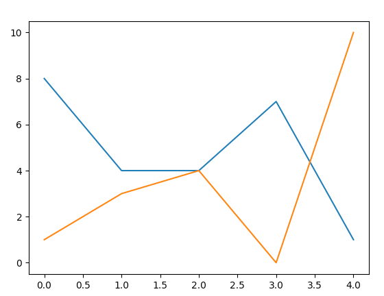

## Get Started 
1. python read_numbers.py

2. image will pop up afterward


## How it works
1. you may change the source 
`with open('example.txt', 'r') as fh:`

2. in `example.txt` file, you may find the numbers
    ```1,8,5
        3,4,5
        4,4,2
        0,3,7
        8,1,4 
    ```

## Example


## Reference
1. [Matplotlib](https://matplotlib.org/tutorials/introductory/pyplot.html#formatting-the-style-of-your-plot)